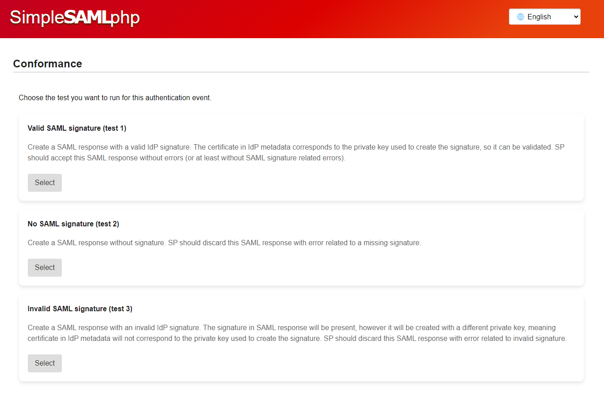

[](https://github.com/cicnavi/simplesamlphp-module-conformance/actions/workflows/test.yml)

# simplesamlphp-module-conformance

SimpleSAMLphp module provides conformance functionality using SimpleSAMLphp authentication processing filters feature.

## Features

- authentication processing filter that can modify SAML Responses, that is, create invalid ones in order to test SP
behavior
- ability to run tests from the module UI
- ability to run bulk tests using the cron feature in SimpleSAMLphp
- API, which:
  - enables programmatic control and execution of tests
  - exposes test results in JSON format

## Installation

Module requires SimpleSAMLphp version 2 or higher.

Module is installable using Composer:

```shell
composer require cicnavi/simplesamlphp-module-conformance
```

In config.php, search for the "module.enable" key and set 'conformance' to true:

```php
// ...
'module.enable' => [
    'conformance' => true,
    // ...
],
// ...
```

## Configuration

As usual with SimpleSAMLphp modules, copy the module template configuration to the SimpleSAMLphp config directory:

```shell
cp modules/conformance/config-templates/module_conformance.php config/
```

Next step is to configure available options in file config/module_conformance.php. Each option has an explanation,
however, the description of the overall concept follows.

### Database connection

This module needs a database connection to be set in config/config.php. Once the connection is set, navigate to
SimpleSAMLphp administration area > Configuration > Conformance (Details area) > Module Overview, and run the
available migrations. 

Related to DB config, note that this module relies on PDO as being set as one of the types of metadata storage handlers
in SimpleSAMLphp. You can go through the following documentation to set it up:
<https://simplesamlphp.org/docs/stable/simplesamlphp-metadata-pdostoragehandler>.
You don't have to import existing flatfile metadata files if you don't want to. You are free to use any other metadata
source supported by SimpleSAMLphp.

Alternatively or in case of automatic / scripted deployments, you can run the 'bin/install.php' script from the
command line:

    php modules/oidc/bin/install.php

This script will run all Conformance module migrations as well as migrations for the PDO metadata storage handler. 

### Nuclei installation

In order to run Nuclei tests from the conformance module UI, the Nuclei has to be installed on the server. In addition,
SimpleSAMLphp (web server) has to be able to run it.

The Nuclei working directory will be the one set in the 'datadir' option in config/config.php. Make sure that
SimpleSAMLphp can write to it. This directory will be used to store Nuclei related data like its internal config and
cache... It will also be used to store any temporary test result artifacts like JSON reports, screenshots, etc.

### Sending emails

Conformance module can be set to ask Service Provider contacts for consent before running tests on them. It will do that
by emailing them a link which can be used to accept testing. In order to be able to send emails, make sure to set
appropriate email related options in config/config.php (and that you have appropriate software available like
sendmail / postfix / smtp, depending on your configuration...).

### Adding Authentication Processing Filter

In order to be able to alter SAML responses, it is necessary to add an [authentication
processing filter](https://simplesamlphp.org/docs/stable/simplesamlphp-authproc.html) from the conformance module
to the right place in SimpleSAMLphp configuration. Here is an example of setting it globally for all IdPs
in config/config.php:

```php
// ...
'authproc.idp' => [
        // ... 
        1000 => 'conformance:Conformance',
    ],
// ...
```

## Running tests

Conformance module can be used to hook into the authentication process and modify SAML responses sent to the SP.

Prior to running tests, of course, the SAML trust between the Conformance IdP and particular SP has to be established
(SAML metadata exchanged).

Also, consider if you need SP consent to run tests on it. Check the module configuration on how to enable / disable
consent requirement.

### Manual testing

For manual testing and validation, SP can simply initiate the authentication using the Conformance IdP
(SP initiated flow), in which case the Conformance IdP will present the screen with available test options prior to 
returning the SAML response:



After the test selection, Conformance IdP will return the (modified) SAML response so one can observe if the SP is
behaving appropriately.

### Running single tests from Conformance module UI

On the other hand, administrator can use the Conformance module UI to initiate all tests using the Nuclei tool.
To do that, navigate to SimpleSAMLphp administration area > Configuration > Conformance (Details area) > Run Nuclei Test.

Choose the desired SP and click Run. This will invoke the Nuclei tool in the backend and start testing using the
predefined testing templates, and then stream all of its output to the screen.

After the testing is done, results can be seen on the Nuclei Results page.

### Bulk testing

Bulk testing can be executed using [SimpleSAMLphp Cron module](https://github.com/simplesamlphp/simplesamlphp/blob/master/modules/cron/docs/cron.md).
As you can see in Cron documentation, a cron tag can be invoked using HTTP or CLI. Of course, with Conformance testing
using CLI is the preferred way, since testing can take a (relatively) long time depending on the number of SPs. 
However, you are free to test execution using the HTTP version, in which case the maximum execution time
will correspond to the 'max_execution_time' INI setting.

Only one test runner instance can run at given point in time. By maintaining internal state, test runner can first check
if there is another runner active. If yes, the latter will simply exit and let the active test runner do its work.
This way one is free to invoke the cron tag at any time, since only one test runner will ever be active.

Make sure to set appropriate cron tags in Conformance module configuration as well as in cron module configuration.

Bulk testing uses the same Nuclei logic, and all test results will be available as described with single tests in UI.

## API

API endpoints are protected with Authorization Bearer token. Available access tokens can be preset in
config/module_conformance.php. Tokens can be 'administrative' (can be used to run tests on any SP), or can be intended
for only particular service providers.

In order to access the API, you must provide the token in the HTTP request as the Authorization header, with Bearer
scheme. For example:

```plain
GET /resource HTTP/1.1
Host: server.example.com
Authorization: Bearer sometoken

...
```

Available endpoints are described below.

### Test setup for next authentication event

Endpoint to define the next test for particular SP. This will determine the shape of the SAML response in the next
authentication event for the given service provider.

URI: `https://conformance-idp.example.com/module.php/conformance/test/setup`

HTTP method: GET

Parameters:

- testId
  - valid values:
    - `standardResponse`: doesn't modify SAML responses (SAML responses are signed with regular private key)
    - `noSignature`: SAML responses don't include signature
    - `invalidSignature`: SAML responses are signed with wrong private key
  - example: `noSignature`
- spEntityId
  - valid values: any trusted SP Entity ID
  - example: `urn:x-simplesamlphp:geant:incubator:simplesamlphp-sp:good-sp`

For example, to specify that the next SAML response for the SP `urn:x-simplesamlphp:geant:incubator:simplesamlphp-sp:good-sp`
should be the one without signature, make an HTTP GET request to:

`https://conformance-idp.example.com/module.php/conformance/test/setup?testId=noSignature&spEntityId=urn:x-simplesamlphp:geant:incubator:simplesamlphp-sp:good-sp`

### Running Nuclei tests using predefined templates

Endpoint which can be used to run all Nuclei tests on a particular service provider using the predefined templates.
This is the same as running Nuclei tests from the Conformance module UI. 
The HTTP response is a streamed output from the Nuclei tool.

URI: `https://conformance-idp.example.com/module.php/conformance/nuclei/test/run`

HTTP method: GET

Parameters:
- spEntityId
  - valid values: any trusted SP Entity ID
  - example: `urn:x-simplesamlphp:geant:incubator:simplesamlphp-sp:good-sp`
- acsUrl (optional) - if not provided, a default SP ACS URL will be used
  - valid values: ACS URL belonging to the SP defined with spEntityId
  - example: `https://good-sp.example.com/saml/acs`
- enableDebug (optional) - parameter forwarded to Nuclei which determines if HTTP requests and responses should be shown
  - valid values: `1` (true), `0` (false, default)
  - example: `1`
- enableVerbose (optional) - parameter forwarded to Nuclei which determines if verbose output should be shown
  - valid values: `1` (true), `0` (false, default)
  - example: `1`

For example, to run tests for the SP `urn:x-simplesamlphp:geant:incubator:simplesamlphp-sp:good-sp`, make an
HTTP GET request to:

`https://conformance-idp.example.com/module.php/conformance/nuclei/test/run?spEntityId=urn:x-simplesamlphp:geant:incubator:simplesamlphp-sp:good-sp`

### Test results list

Endpoint to fetch short test results in JSON format. By default, all results from all SPs will be returned. This can be 
filtered out using parameters below.

URI: `https://conformance-idp.example.com/module.php/conformance/nuclei/results/get`

HTTP method: GET

Parameters:
- spEntityId (optional): can be used to fetch results for particular SP only
  - valid values: any trusted SP Entity ID
  - example: `urn:x-simplesamlphp:geant:incubator:simplesamlphp-sp:good-sp`
- latestOnly (optional): can be used to only fetch latest result per SP
  - valid values: `1` (true), `0` (false, default)
  - example: `1`
  
For example, to fetch all available results, make an HTTP GET request to:

`https://conformance-idp.example.com/module.php/conformance/nuclei/results/get`

To fetch only latest results for all SPs:

`https://conformance-idp.example.com/module.php/conformance/nuclei/results/get?latestOnly=1`

To fetch all results for the SP `urn:x-simplesamlphp:geant:incubator:simplesamlphp-sp:good-sp`:

`https://conformance-idp.example.com/module.php/conformance/nuclei/results/get?spEntityId=urn:x-simplesamlphp:geant:incubator:simplesamlphp-sp:good-sp`

To fetch only the latest result for the SP `urn:x-simplesamlphp:geant:incubator:simplesamlphp-sp:good-sp`:

`https://conformance-idp.example.com/module.php/conformance/nuclei/results/get?spEntityId=urn:x-simplesamlphp:geant:incubator:simplesamlphp-sp:good-sp&latestOnly=1`

### Test result details

Endpoint to fetch particular test result details. This will also return data like full Nuclei findings and Nuclei JSON
report.

URI: `https://conformance-idp.example.com/module.php/conformance/nuclei/results/get/{testResultId}`

HTTP method: GET

Parameters:
  - testResultId (route parameter): ID of the specific test result. It can be found in the test results list.
    - valid values: any test result ID from the test results list
    - example: `74`

For example, to fetch the details of test result with an ID of 74, make an HTTP GET request to:

`https://conformance-idp.example.com/module.php/conformance/nuclei/results/get/74`

### Test result images list

Endpoint to list particular test result images. This will return a list of images with their id, name and URI where
they can be fetched from.

URI: `https://conformance-idp.example.com/module.php/conformance/nuclei/results/get/{testResultId}/images`

HTTP method: GET

Parameters:
- testResultId (route parameter): ID of the specific test result. It can be found in the test results list.
  - valid values: any test result ID from the test results list
  - example: `74`

For example, to fetch images list of test result with an ID of 74, make an HTTP GET request to:

`https://conformance-idp.example.com/module.php/conformance/nuclei/results/get/74/images`

### SP metadata provisioning

Endpoint to provision SP metadata which will be trusted by the Conformance IdP. This feature will use PDO metadata
store to persist metadata.

URI: `https://conformance-idp.example.com/module.php/conformance/metadata/persist`

HTTP method: POST

Parameters:

- xmlData - optional (mandatory if xmlFile not provided)
  - valid values: SAML2 SP metadata XML string
  - example:

    ```xml
    <?xml version="1.0" encoding="utf-8"?>
    <md:EntityDescriptor xmlns:md="urn:oasis:names:tc:SAML:2.0:metadata" entityID="urn:x-simplesamlphp:geant:incubator:simplesamlphp-sp:good-sp">
    <md:SPSSODescriptor protocolSupportEnumeration="urn:oasis:names:tc:SAML:2.0:protocol">
    <md:SingleLogoutService Binding="urn:oasis:names:tc:SAML:2.0:bindings:HTTP-Redirect" Location="https://simplesamlphp-sp.maiv1.incubator.geant.org/simplesaml/module.php/saml/sp/saml2-logout.php/good-sp"/>
    <md:AssertionConsumerService Binding="urn:oasis:names:tc:SAML:2.0:bindings:HTTP-POST" Location="https://simplesamlphp-sp.maiv1.incubator.geant.org/simplesaml/module.php/saml/sp/saml2-acs.php/good-sp" index="0"/>
    <md:AssertionConsumerService Binding="urn:oasis:names:tc:SAML:2.0:bindings:HTTP-Artifact" Location="https://simplesamlphp-sp.maiv1.incubator.geant.org/simplesaml/module.php/saml/sp/saml2-acs.php/good-sp" index="1"/>
    </md:SPSSODescriptor>
    </md:EntityDescriptor>
    ```

- xmlFile - optional (mandatory if xmlData not provided)
  - valid values: SAML2 SP XML metadata file

## IdP Initiated Login

IdP initiated login can be performed as per SimpleSAMLphp documentation: <https://simplesamlphp.org/docs/2.1/simplesamlphp-idp-more.html>

Sample URI to initiate login to SP 'urn:x-simplesamlphp:geant:incubator:simplesamlphp-sp:good-sp':

`https://conformance-idp.example.com/saml2/idp/SSOService.php?spentityid=urn:x-simplesamlphp:geant:incubator:simplesamlphp-sp:good-sp`

## Static analysis and unit tests

To run phpcs, psalm and phpunit:

```shell
composer pre-commit
```
